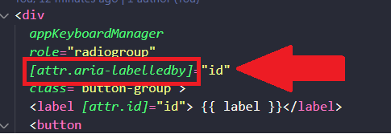
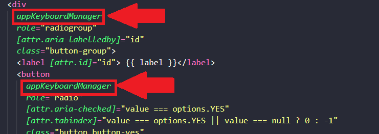

### Bind em aria-label ### 
Para usar o bind em qualquer aria-label que seja, precisamos adicionar o "attr." na frente. Por exemplo: 

 

### Utilizando Diretivas ###
<b>O que são diretivas? </b> 
Quando temos uma lógica que possivelmente será usada em mais de um lugar na aplicação, você deve abstraí-la para uma diretiva. Assim, ela funciona como um "novo componente" que você pode chamar direto no template. Por exemplo: 

