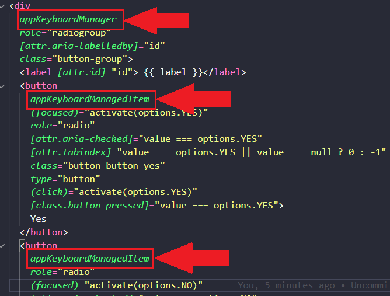

### Bind em aria-label ### 
Para usar o bind em qualquer aria-label que seja, precisamos adicionar o "attr." na frente. Por exemplo: 

</br>

### Utilizando Diretivas ###
<b>O que são diretivas? </b></br>
Quando temos uma lógica que possivelmente será usada em mais de um lugar na aplicação, você deve abstraí-la para uma diretiva. Assim, ela funciona como um "novo componente" que você pode chamar direto no template. Por exemplo: 



</br></br>

<h3><b>ContentChildren</b></h3>
Busca todo mundo que é filho do elemento no qual a diretiva KeyboardManagerDirective faz parte, pega todos esses filhos e traz apenas aqueles que têm a diretiva KeyboardManagedItemDirective.


Essa implementação, nos possibilita trazer as opções dentro de um array por causa da <b><i>QueryList</i></b>. 


</br><h3><b>QueryList</b></h3>
Sempre que uue um elemento filho é adicionado, removido ou movido, a lista de consulta será atualizada e as alterações observáveis na lista de consulta emitirão um novo valor.


</br>

!!Atenção!! </br>
Quando usamos as tags semânticas do HTML, tornamos o trabalho de transformar o aplicativo acessível mais fácil. No código abaixo, poderíamos utilizar as setas do teclado, sem precisar implementar as diretivas que foram usadas nesse projeto. 

```
<div
  class="button-group"
  role="radiogroup"
  [attr.aria-labelledby]="id"
  >
  <label [attr.id]="id"> {{ label }}</label>
  <div 
    class="radio">
    <input
      [attr.id]="id + '-yes'"
      [attr.name]="id"
      [attr.checked]="value === options.YES"
      (change)="activate(options.YES)"
      type="radio"
      >
      <label 
        [attr.id]="id + '-yes'"
        class="button button-yes"
        > 
        Yes
      </label>
  </div>
  <div 
    class="radio">
    <input
      [attr.id]="id + '-no'"
      [attr.name]="id"
      [attr.checked]="value === options.NO"
      (change)="activate(options.NO)"
      type="radio"
      >
      <label 
        [attr.id]="id + '-no'"
        class="button button-no"
        > 
        No
      </label>
  </div>
</div>
```


Site para verificar as regras oficiais de acessibilidade: 
https://www.w3c.br/traducoes/wcag/wcag21-pt-BR/

Extensão do chrome para testar a acessibilidade: </br>
<b>ChromeVox</b>

